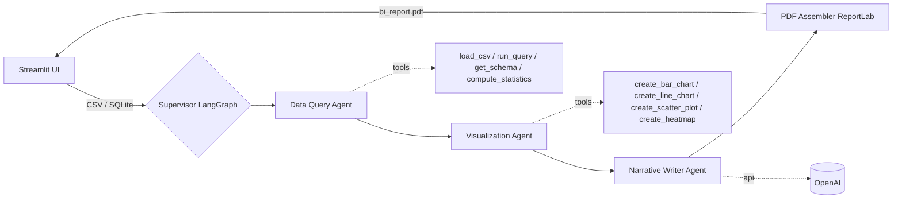

# Multi-Agent Data Analyst

A production-ready business-intelligence report generator. Three specialized AI agents,
orchestrated with **LangGraph**, collaborate to turn a CSV or SQLite file into a polished
PDF report containing a narrative analysis and embedded charts. A **Streamlit** UI lets you
upload data, watch each agent run in real time, and download the final report.

## Architecture



The supervisor enforces a fixed, validated sequence: **Query -> Visualization -> Narrative -> PDF**.
State is passed between nodes as a typed `AnalysisState` dictionary.

## Project structure

```
multi-agent-analyst/
├── agents/            # query_agent, viz_agent, narrative_agent
├── tools/             # data_tools (pandas), viz_tools (plotly)
├── orchestrator/      # state, graph (LangGraph), pdf_builder (ReportLab)
├── ui/                # Streamlit app
├── tests/             # pytest unit tests
├── data/              # sample_sales.csv demo dataset
├── outputs/           # generated charts + PDFs (gitignored)
├── requirements.txt
├── .env.example
├── Dockerfile
└── docker-compose.yml
```

## Quick start (local)

```bash
git clone https://github.com/sbandi22/multi-agent-analyst.git
cd multi-agent-analyst

python -m venv .venv
source .venv/bin/activate        # Windows: .venv\Scripts\activate
pip install -r requirements.txt

cp .env.example .env             # add your OpenAI key (optional - see note below)
streamlit run ui/app.py
```

Then open http://localhost:8501, upload `data/sample_sales.csv`, and click **Generate Report**.

> **No API key?** The Narrative agent falls back to a deterministic, locally-generated report,
> so the whole pipeline still runs end-to-end after cloning. Add `OPENAI_API_KEY` to `.env`
> for an LLM-authored narrative.

## Run with Docker

```bash
cp .env.example .env             # optional: add OPENAI_API_KEY
docker compose up --build
# open http://localhost:8501
```

## Run the tests

```bash
pip install -r requirements.txt
pytest -q
```

## The three agents

**1. Data Query Agent** loads the input, infers the schema, and computes summary statistics,
correlations, and z-score-based anomalies. Tools: `load_csv`, `run_query`, `get_schema`,
`compute_statistics`.

**2. Visualization Agent** selects appropriate columns and produces 3-5 Plotly charts
(bar, line, scatter, heatmap), saved as PNGs via Kaleido. Tools: `create_bar_chart`,
`create_line_chart`, `create_scatter_plot`, `create_heatmap`.

**3. Narrative Writer Agent** turns the data summaries and chart descriptions into a
500-800 word report (Executive Summary, Key Findings, Trends, Recommendations) using the
OpenAI API, with a deterministic fallback.

The **Supervisor** (in `orchestrator/graph.py`) wires these into a LangGraph `StateGraph`
and, as a final node, assembles the narrative and charts into `outputs/bi_report.pdf`.

## Tech stack

Python 3.11 · LangGraph · LangChain · OpenAI · Pandas · Plotly · ReportLab · Streamlit · Docker

## Sample dataset

`data/sample_sales.csv` is a synthetic 72-row sales dataset (date, region, product, category,
sales rep, units, unit price, revenue) with a couple of intentional outliers so the anomaly
detection and charts have something interesting to show.
